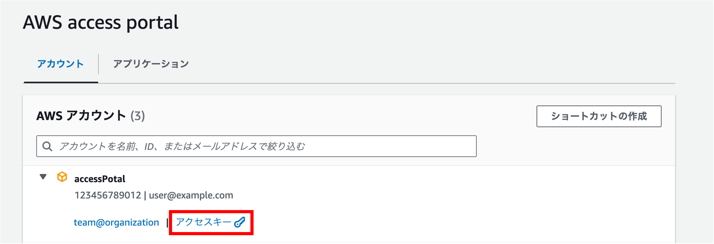

# Fargate接続ツールの説明

## 事前準備
- クライアント側でECS Execを利用可能にしておく
- 参考情報
  - https://docs.aws.amazon.com/ja_jp/AmazonECS/latest/userguide/ecs-exec.html
  - https://docs.aws.amazon.com/ja_jp/systems-manager/latest/userguide/session-manager-working-with-install-plugin.html


## 利用方法

### アクセスキー確認



### 手動でAWSアクセス資格取得確認

```
$ aws configure --profile "profile_name"
```

`profile_name`は自分のプロフィールをご利用ください。次の説明から`profile_name`は自分のプロファイル名を使用するものとします。


### ブラウザでAWS SSO画面でログインしてAWSアクセス資格取得

```
$ aws configure sso --profile profile_name
```

`profile_name`は自分のプロフィールをご利用ください。

ブラウザでAWS SSOのアクセスキー情報でAWS SSOの接続先の情報をローカルに設定します。

`aws sso login`コマンドでブラウザでログインしてAWSアクセス資格を取得します。この方法を利用すると「手動でAWSアクセス資格取得確認」の方法を利用する必要はありません。

#### 設定情報保存先

`profile_name`は自分のプロフィール名なのか確認ください。

`~/.aws/config`ファイルに認証情報が設定されます。
`~/.aws/config`で設定情報を確認できます。

```
vi ~/.aws/config
```

### Profileを設定して、sso login する

`aws sso login`コマンドを利用してAWSで情報を取得するために、ローカルに設定した認証情報でAWSアクセス資格を取得します。

#### プロフィールを指定してログイン

```
$ export AWS_PROFILE=profile_name; aws sso login
```

`profile_name`は自分のプロフィールをご利用ください。

(url をブラウザで参照し、 codeを入力する)

#### シェルが起動するたびにその変数が自動的にプロフィール指定

bash 環境

```
$ echo 'export AWS_PROFILE=profile_name' >> ~/.bashrc
$ source ~/.bashrc
```

zsh 環境

```
echo 'export AWS_PROFILE=profile_name' >> ~/.zshrc
source ~/.zshrc
```

セール設定ファイルで上の設定が行なってからは`export AWS_PROFILE=profile_name;`を書かなく、`aws sso login`コマンドだけでAWSアクセス資格を取得します。

### AWSアクセス資格取得確認

```
$ aws configure list
```

```
      Name                    Value             Type    Location
      ----                    -----             ----    --------
   profile             profile_name              env    ['AWS_PROFILE', 'AWS_DEFAULT_PROFILE']
access_key     ****************ABCD   shared-credentials-file    
secret_key     ****************EFGH   shared-credentials-file    
    region           ap-northeast-1       config-file    ~/.aws/config
```

### pipコマンド

pythonのインストールが必要

MacOSの場合は`pip`を`pip3`で使用している場合があります。

### モジュールのインストール

```
$ pip install -r requirements.txt
```

### Session Manager プラグインインストール(下記URLはMacOSでのインストール方法)

https://docs.aws.amazon.com/ja_jp/systems-manager/latest/userguide/session-manager-working-with-install-plugin.html#install-plugin-macos

### aws cli のインストール

https://docs.aws.amazon.com/ja_jp/cli/latest/userguide/getting-started-install.html

### リンク作成

```
$ sudo ln -s $(pwd)/connect_to_fargate.py /usr/local/bin
```

初期設定で一回実行する必要があります。一回設定されてからは再度設定する必要はありません。

### ログディレクトリ作成(任意)

```
$ mkdir -p ~/.connect_to_fargate/log
```

初期設定で一回実行する必要があります。一回設定されてからは再度設定する必要はありません。

### スクリプト実行する

```
$ connect_to_fargate.py
```

このコマンドを実行する前にAWSからアクセス資格を取得する必要があります。`aws sso login`の説明をご参考ください。

※connect_to_fargate.py_(日時).logにログが出力されます。

※引数に以下を利用できるように追加しました。

--cluster=クラスター名（指定ない場合は、対話型の選択画面に遷移）

--service=サービス名（指定ない場合は、対話型の選択画面に遷移）

--task=タスク名（指定ない場合は、対話型の選択画面に遷移）

--container=コンテナ名（指定ない場合は、対話型の選択画面に遷移）

--cmd=コンテナで実行するコマンド（指定ない場合は、/bin/bash）

※Ctrl + Cの挙動は変更しました（接続処理直前にSIGINTをSIG_IGNに変換する処理を追加）


### 実行結果（例１ 引数なし）

```
$ connect_to_fargate.py
```

```
処理を開始します
[?] 接続先が存在するクラスター名を選択してください:
 ❯ default
   cluster_a
   cluster_b

クラスター名: default

[?] 接続先が存在するサービス名を選択してください:
 ❯ service_a
   service_b

サービス名: service_a

[?] 接続先が存在するタスク名を選択してください:
 ❯ 779933414f454c76960d15b37ab15f26

タスク名: 779933414f454c76960d15b37ab15f26

[?] 接続先のコンテナ名を選択してください: app
 ❯ app
   web

コンテナ名: app

以下のFargateに接続します
----------------------------------------
クラスター名: default
サービス名: service_a
タスク名: 779933414f454c76960d15b37ab15f26
コンテナ名: app
----------------------------------------

[?] こちらに接続してよろしいですか: yes
 ❯ yes
   no

Fargateにログインします

The Session Manager plugin was installed successfully. Use the AWS CLI to start a session.


Starting session with SessionId: ecs-execute-command-08107c57e1eb5fee9
root@ip-172-30-2-204:/#
↑コンテナにログインしている
exit


Exiting session with sessionId: ecs-execute-command-08107c57e1eb5fee9.

CompletedProcess(args='/usr/local/bin/aws ecs execute-command --cluster test-cluster --task 87b5a48c8b99450d9dea5443c863ee5d --container nginx --interactive --command /bin/bash | tee ./connect_to_fargate.py_20220629090944872720.log', returncode=0)
Fargateからログアウトしました
```

### 実行結果（例２ 一部引数あり）

```
$ connect_to_fargate.py --cluster=default --container=web
```

```
処理を開始します
[?] 接続先が存在するサービス名を選択してください:
 ❯ service_a
   service_b

サービス名: service_a

[?] 接続先が存在するタスク名を選択してください:
 ❯ 779933414f454c76960d15b37ab15f26

タスク名: 779933414f454c76960d15b37ab15f26

以下のFargateに接続します
----------------------------------------
クラスター名: default
サービス名: service_a
タスク名: ae95d0c222424643be7ddd8e288b1229
コンテナ名: web
----------------------------------------

[?] こちらに接続してよろしいですか: yes
 ❯ yes
   no

Fargateにログインします
（略）
```

### 実行結果（例３ fargatessh利用）

```
$ fargatessh -p profile -c default -t app -f
```

```
処理を開始します
[?] 接続先が存在するサービス名を選択してください:
 ❯ service_a
   service_b

サービス名: service_a

[?] 接続先が存在するタスク名を選択してください:
 ❯ 779933414f454c76960d15b37ab15f26

タスク名: 779933414f454c76960d15b37ab15f26

以下のFargateに接続します
----------------------------------------
クラスター名: default
サービス名: service_a
タスク名: ae95d0c222424643be7ddd8e288b1229
コンテナ名: web
----------------------------------------

Fargateにログインします
（略）
```

## トラブルシューティング
'ServiceNotActiveException'が発生した場合
以下を実行して新しいタスクに入れ替える
```
aws ecs update-service \
--cluster (クラスター名) \ 
--service (サービス名) \
--enable-execute-command
'TargetNotConnectedException'が発生した場合
正しいセキュリティグループにしているか、ネットワーク経路が確保されているかを確認する
```

### 汎用的な調査方法
https://github.com/aws-containers/amazon-ecs-exec-checker
check-ecs-execを実行する
```
[実行例]
$ check-ecs-exec.sh (クラスター名) (タスク名)
※/usr/local/binに配置しているため

[実行結果]
-------------------------------------------------------------
Prerequisites for check-ecs-exec.sh v0.7
-------------------------------------------------------------
  jq      | OK (/usr/bin/jq)
  AWS CLI | OK (/usr/local/bin/aws)

-------------------------------------------------------------
Prerequisites for the AWS CLI to use ECS Exec
-------------------------------------------------------------
  AWS CLI Version        | OK (aws-cli/2.6.3 Python/3.9.11 Linux/5.10.118-111.515.amzn2.x86_64 exe/x86_64.amzn.2 prompt/off)
  Session Manager Plugin | OK (1.2.339.0)

-------------------------------------------------------------
Checks on ECS task and other resources
-------------------------------------------------------------
Region : ap-northeast-1
Cluster: (クラスター名)
Task   : (タスク名)
-------------------------------------------------------------
  Cluster Configuration  | Audit Logging Not Configured
  Can I ExecuteCommand?  | arn:aws:iam::172972874842:role/aws-reserved/sso.amazonaws.com/ap-northeast-1/AWSReservedSSO_Administrators@System_10607a14223798a0
     ecs:ExecuteCommand: allowed
     ssm:StartSession denied?: allowed
  Task Status            | RUNNING
  Launch Type            | Fargate
  Platform Version       | 1.4.0
  Exec Enabled for Task  | NO　　　←今回の実行例の場合はこれが原因
  Container-Level Checks |
    ----------
      Managed Agent Status - SKIPPED
    ----------
    ----------
      Init Process Enabled ((タスク名):(タスクのバージョン))
    ----------
         1. Disabled - "web"
         2. Disabled - "app"
    ----------
      Read-Only Root Filesystem ((タスク名):(タスクのバージョン))
    ----------
         1. Disabled - "web"
         2. Disabled - "app"
  Task Role Permissions  | arn:aws:iam::172972874842:role/ecsTaskRole
     ssmmessages:CreateControlChannel: allowed
     ssmmessages:CreateDataChannel: allowed
     ssmmessages:OpenControlChannel: allowed
     ssmmessages:OpenDataChannel: allowed
  VPC Endpoints          |
    Found existing endpoints for vpc-00000000000000:
      - com.amazonaws.ap-northeast-1.s3
      - com.amazonaws.ap-northeast-1.kms
      - com.amazonaws.ap-northeast-1.ec2messages
      - com.amazonaws.ap-northeast-1.ssm
      - com.amazonaws.ap-northeast-1.ssmmessages
      - com.amazonaws.ap-northeast-1.secretsmanager
  Environment Variables  | (wordpress-development:37)
       1. container "web"
       - AWS_ACCESS_KEY: not defined
       - AWS_ACCESS_KEY_ID: not defined
       - AWS_SECRET_ACCESS_KEY: not defined
       2. container "app"
       - AWS_ACCESS_KEY: not defined
       - AWS_ACCESS_KEY_ID: not defined
       - AWS_SECRET_ACCESS_KEY: not defined
 ```
